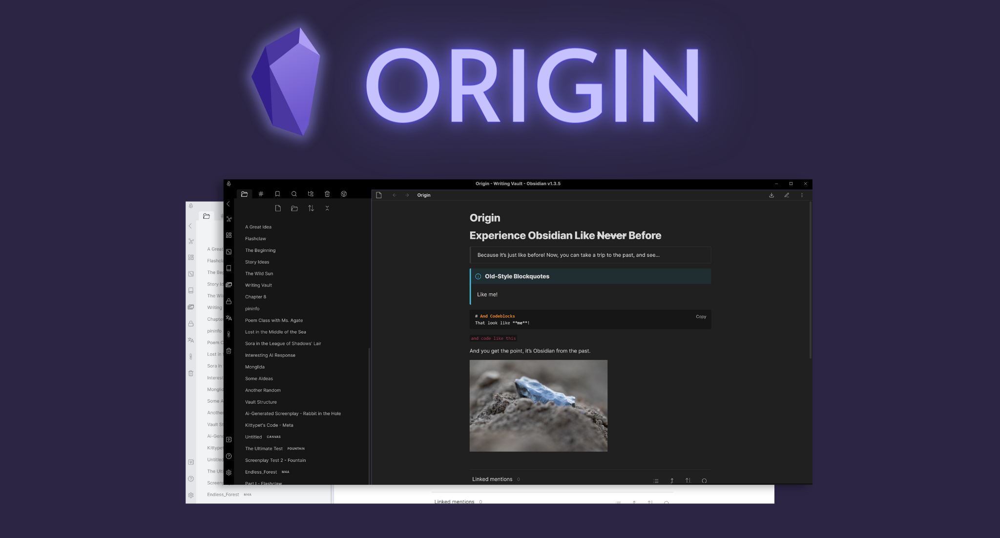

# Obsidian Origin

> ### Ever wish you could go back?

Back to before canvas existed? Before graph view had all these fancy options? Before tabs were a thing?

Back when default mode's dark theme was *the best?*

 

Well, now you **can!** With **Origin**, you can experience Obsidian like it was in the olden days, before the design changes that came with version 1.0.0. Old blockquotes, old callouts, old checkboxes, old layout, everything! But, you can enjoy this design with all of the features that come with the new Obsidian! How awesome is that!

